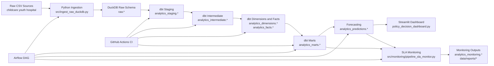
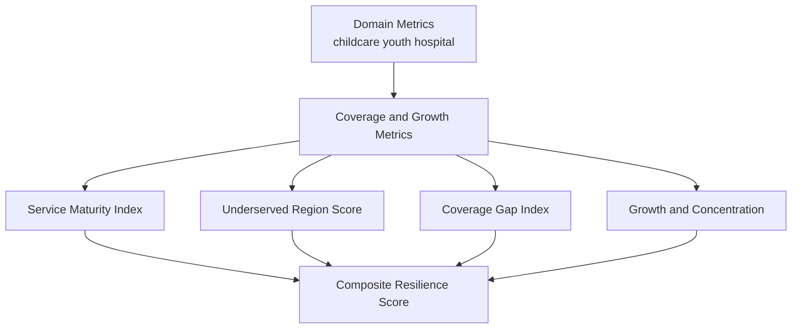
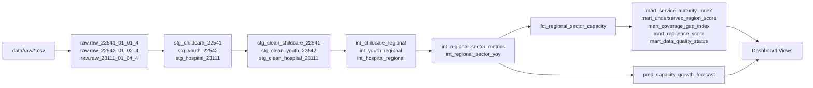
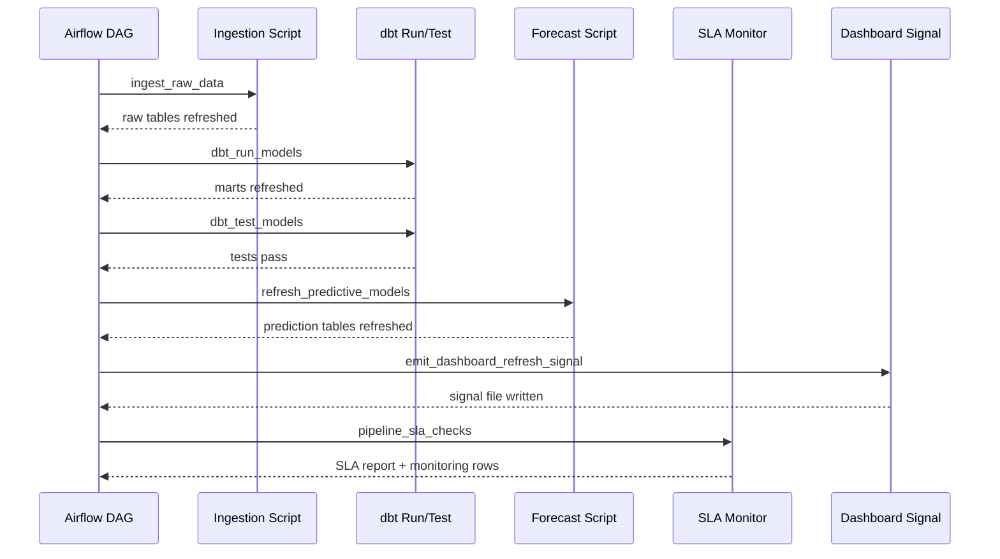

# Architecture and Defense Diagrams

This document provides diagram assets for defense, thesis, and interview walkthroughs.

## 1. End-to-End Architecture

## 2. KPI Composition Diagram

## 3. Data Lineage Diagram

## 4. Orchestration Sequence Diagram

